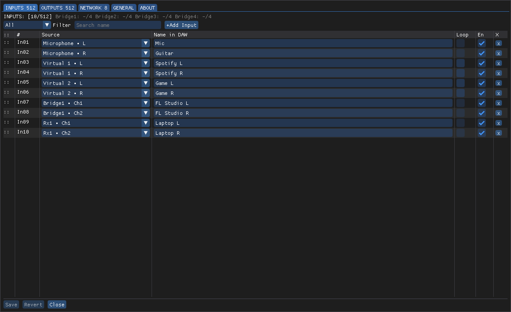
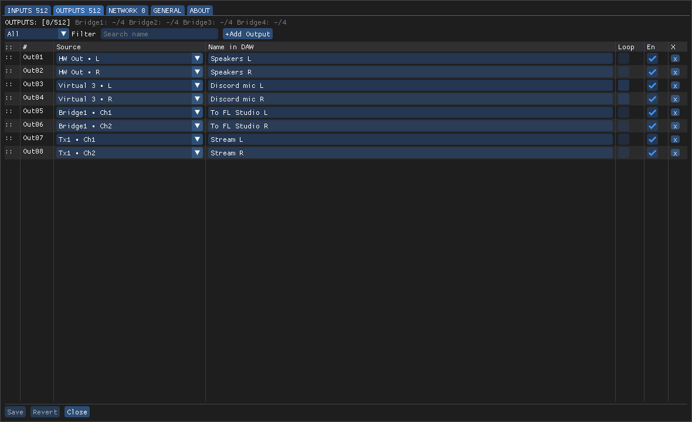
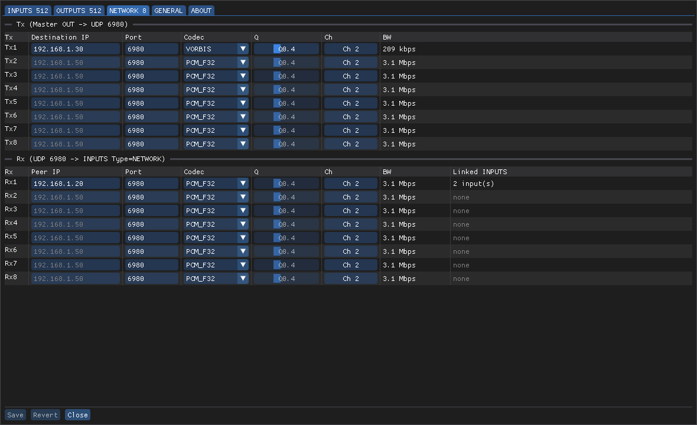
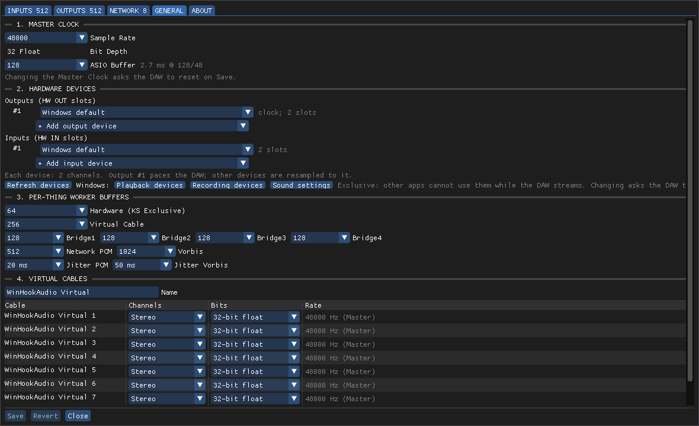

# WinHookAudio

[](LICENSE)
[](https://github.com/sponsors/LogicCuteGuy)

WinHookAudio routes all PC audio through one DAW, the **Master DAW**, which works as the mixer and
effects rack. It is an ASIO driver for Windows, written in C++.

```
sound cards, Windows apps, other DAWs, LAN  ->  WinHookAudio Master (ASIO)  ->  your DAW mixes  ->  back out
```

## What is inside

| Part | What it does |
|---|---|
| **WinHookAudio Master** (ASIO driver) | 512 inputs + 512 outputs for the Master DAW. Each slot is fed by a sound card, a Virtual Cable, a Bridge or the network. |
| **HW devices** | Up to 4 output and 4 input sound cards (WASAPI), each kept in time with the Master Clock. |
| **Virtual Cables** (`WinHookAudio.sys`) | 8 cables that appear in Windows as sound devices (up to 8 channels each). Windows apps play into them or record from them. |
| **WinHookAudio Bridge 1-4** (ASIO drivers) | Let other DAWs or ASIO apps send and receive a set of channels; up to 4 apps share one Bridge. |
| **Network streams** (WHAA) | Send and receive audio on the LAN over UDP 6980-6981, as PCM or Vorbis. |
| **Control Panel** | Opens from the DAW's ASIO settings: pick what feeds each slot, the Master Clock, devices, cables and streams. Saved to `%ProgramData%\WinHookAudio\routes.yml` + `settings.yml`, with Export / Import. |

**Status:** early. It is tested on the developer's PC only (Windows 10 x64 with Bitwig Studio). Expect bugs; please report them in [Issues](https://github.com/LogicCuteGuy/WinHookAudio/issues).

> **The Virtual Cable driver (`WinHookAudio.sys`) is experimental.** It is a kernel driver: a bug in
> it can stop Windows with a blue screen. It has not yet run under Driver Verifier or a long soak test,
> and short audio dropouts still happen in stress tests. Use it on a PC where a crash is acceptable,
> or untick Virtual Cable in the installer.

## Screenshots

The Control Panel (opens from the DAW's ASIO settings), with example routes:

| Inputs: what feeds each DAW input | Outputs: where each DAW output goes |
|---|---|
| [](docs/images/panel-inputs.png) | [](docs/images/panel-outputs.png) |
| **Network: LAN streams (PCM or Vorbis)** | **General: Master Clock, devices, buffers, Virtual Cables** |
| [](docs/images/panel-network.png) | [](docs/images/panel-general.png) |

## Install

1. Download `WinHookAudio-Setup-<version>.exe` from [Releases](https://github.com/LogicCuteGuy/WinHookAudio/releases).
2. Run it (admin rights needed) and choose the Virtual Cable driver on the **Components** page:

   | Choice | When to pick it |
   |---|---|
   | **Signed driver** (normal Windows) | Shown only when the release has a Microsoft-signed driver. Works like any other driver. |
   | **Not signed: test-signed driver** | Turns on Windows **Test Mode** and needs a restart. **Secure Boot must be off** (in the PC's UEFI settings). Windows shows "Test Mode" on the desktop. |
   | Neither (untick Virtual Cable) | Only the ASIO drivers. Sound cards, Bridges and the network still work; Virtual Cables do not. |

3. In your DAW, choose the ASIO driver **WinHookAudio Master**, then open its Control Panel.

Uninstall from Windows Settings > Apps. It removes the drivers, the Virtual Cable device and the
firewall rule. It turns Test Mode off again only if the installer turned it on.

More detail: [docs/installing.md](docs/installing.md).

## Build from source

Needs Windows 10/11 x64, Visual Studio 2022 or newer with C++ (MSVC x64), CMake 3.24+, and for
the Virtual Cable driver the [Windows Driver Kit](https://learn.microsoft.com/windows-hardware/drivers/download-the-wdk).
The installer needs [Inno Setup 6.3+](https://jrsoftware.org/isdl.php).

```powershell
scripts\Fetch-ThirdParty.ps1                      # ImGui, libogg, libvorbis, r8brain (pinned) into third_party\
cmake -S . -B build -A x64
cmake --build build --config Release
ctest --test-dir build -C Release -E network      # offline tests
driver\build.cmd                                  # WinHookAudio.sys, test-signed, into build\driver\
installer\build-installer.ps1 -Version 0.1.0      # build\installer\WinHookAudio-Setup-0.1.0.exe
```

GitHub Actions ([build.yml](.github/workflows/build.yml)) builds and tests every push, and a
`v*` tag publishes the setup to GitHub Releases. That setup has no test-signed driver: it offers
the Virtual Cable only with a Microsoft-signed driver. The test-signed setup is built locally with
the steps above. Code signing is in [docs/signing.md](docs/signing.md).

## Docs

- [Installing and Test Mode](docs/installing.md)
- [Code and driver signing](docs/signing.md)
- [Architecture](docs/architecture.md) and [implementation plan](docs/implementation-plan.md)
- [Decisions (ADRs)](docs/adr/) and [domain words](CONTEXT.md)

## Code signing policy

Free code signing provided by [SignPath.io](https://about.signpath.io/), certificate by
[SignPath Foundation](https://signpath.org/) (applied for; releases are not signed yet).

- Committers and reviewers: [LogicCuteGuy](https://github.com/LogicCuteGuy)
- Approvers: [LogicCuteGuy](https://github.com/LogicCuteGuy)

Only files built by GitHub Actions from this repository are signed: the setup, the ASIO drivers
and `winhookaudio-devsetup.exe`. The Virtual Cable kernel driver (`WinHookAudio.sys`) needs a
Microsoft signature instead ([docs/signing.md](docs/signing.md)).

## Privacy

This program will not transfer any information to other networked systems unless specifically
requested by the user or the person installing or operating it.

WinHookAudio has no telemetry, no account and no update check. The only network feature is the
network streams: they send audio only to the IP addresses you enter in the Control Panel, and
receive audio on UDP ports 6980-6981 (the installer opens these in Windows Firewall). Settings stay
on your PC in `%ProgramData%\WinHookAudio\`.

## Credits

WinHookAudio is made by **[LogicCuteGuy](https://github.com/LogicCuteGuy)**: design, ASIO drivers,
Virtual Cable driver, Control Panel, installer.

## License

[MIT](LICENSE), Copyright (c) 2026 LogicCuteGuy. Third-party parts are listed in [THIRD-PARTY-NOTICES.md](THIRD-PARTY-NOTICES.md).
ASIO is a trademark and software of Steinberg Media Technologies GmbH.

## Support the project

If WinHookAudio helps you, you can support it:
[GitHub Sponsors](https://github.com/sponsors/LogicCuteGuy) ·
[Ko-fi](https://ko-fi.com/logiccuteguy) ·
[Donate](https://profile.logiccuteguy.com/#donate)
