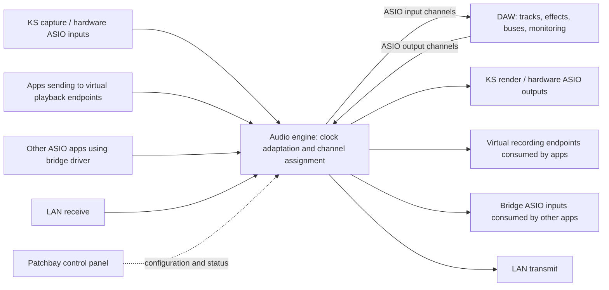

# WinHookAudio architecture

Status: proposed design, 2026-09-09. This is a build direction, not a claim of working audio. See the [research](research/windows-audio-constraints.md) for Windows and ASIO evidence.

## Product contract

The user confirmed that “hook KS” means exposing devices and virtual cables to the DAW. **The DAW is the ASIO host; this project is the C/C++ ASIO driver loaded by that host.** The DAW is the central mixer, effects processor, and router. The driver's native C++ control panel manages device settings and channel assignments and is opened through the host's ASIO settings.

Production implementation uses C++20 for user-mode components, C-compatible ABI boundaries where needed, and WDK-compatible C/C++ for the separate virtual cable kernel component. The native panel uses C++/Win32; any later GUI library must preserve the C/C++ implementation requirement. The HTML concept is only a reference for layout and interaction.

One primary ASIO driver, **WinHookAudio ASIO**, presents a stable bank of named inputs and outputs to the DAW. Proposed initial bank: 32 inputs and 32 outputs. Larger banks require a stopped session and driver reinitialization. Unassigned or unavailable inputs produce silence; unused outputs are discarded. Device disconnects never renumber DAW channels.

The primary DAW loads our user-mode ASIO DLL, initializes it, negotiates channels/rate/buffers, supplies callbacks, and starts/stops streaming. The driver delivers captured input buffers and invokes the host callbacks according to the audio timeline; the DAW processes audio and fills output buffers for the driver to deliver. The project supplies both sides of device transport around that DAW processing step.

An engine/helper process, if used for transport or third-party-driver isolation, remains an implementation component of this driver system. It does not replace the DAW's role as primary ASIO host. Only the optional hardware-ASIO adapter acts as a host to an existing manufacturer's driver. Other ASIO applications open distinct bridge slots.

## Components and boundaries

| Component | Responsibility | Proposed implementation |
| --- | --- | --- |
| Primary ASIO driver | Channel names/types, sample rate, buffers, callbacks, sample position, latency reporting, control-panel entry | C++ user-mode Windows DLL loaded by the DAW; Steinberg SDK interface |
| Engine process | Device ownership, master clock, transport, format conversion, bounded scheduling | Native C++ audio runtime, separate from GUI |
| KS adapter | Discover filter/pin capabilities; open compatible capture/render pins | Native KS/WaveRT adapter, with capability checks |
| WASAPI adapter | Compatibility path and initial proof using installed cable endpoints | Event-driven WASAPI; actual mode and period shown |
| Hardware ASIO adapter | Host an existing manufacturer's ASIO driver | Isolated worker per driver when multiple drivers are needed; no assumption of multi-client support |
| Bridge ASIO driver | Present independent send/return channel banks to other ASIO apps | Reuse primary transport with separate client identity and rings |
| Virtual cable driver | Expose our own Windows playback and recording endpoints | Separate WDM/WaveRT kernel driver, adapted from Microsoft samples; real transport must be written |
| LAN adapter | Packet send/receive, jitter management, drift adaptation | Protocol behind an adapter; VBAN first candidate for this machine |
| Control panel | Two-row device grid, settings, presets, diagnostics | Native C++/Win32 panel launched by the driver's controlPanel() entry; GUI lifetime independent of streaming |

Start x64; add an x86 ASIO shim for 32-bit host compatibility when implemented and tested. Define a versioned shared-memory ABI with fixed-width fields instead of sharing native pointers or compiler-dependent structures. Keep the production runtime and panel native; the earlier HTML concept adds no web runtime requirement.

The ASIO DLL and virtual cable kernel driver are separate deliverables. The DAW loads the ASIO DLL; Windows loads the cable driver to expose playback/recording endpoints. ASIO support by itself does not create Windows cable endpoints.

## Channel direction and cable semantics

Everything in the grid is named from the **primary DAW's perspective**.

| Grid row | KS / hardware | App cable slot | ASIO bridge slot | LAN |
| --- | --- | --- | --- | --- |
| **To DAW / inputs** | Capture channels | App playback entering the engine | Other app's ASIO outputs | Received stream |
| **From DAW / outputs** | Render channels | Processed audio exposed to an app's recording input | Other app's ASIO inputs | Transmitted stream |

A slot is a logical grouping. A USB microphone can have only the top row; headphones can have only the bottom row. A pair of unrelated devices must not be represented as a single shared hardware clock.

For the custom virtual endpoints, app playback enters the engine and DAW output independently feeds app recording. No automatic playback-to-recording passthrough is created. When prototyping with conventional one-way cables, use two independent cable paths for a duplex send/return; sending a DAW return into the same cable being captured can form feedback.

Each cell contains explicit device-channel → DAW-channel assignments, enabled state, endpoint format, endpoint period, and status. Stereo linking is a convenience; the production channel editor supports mono and arbitrary channel permutations. Default policy: one producer per DAW input channel. Reject overlapping assignments rather than silently summing. One DAW output may fan out to multiple destinations. Mixing happens inside the DAW.

## Clock and latency model

**Proposal:** choose the main monitoring hardware as the master clock when available. Expose its timeline through the primary ASIO driver. With no hardware master, use a paced internal timeline. Losing the master mutes and stops the session; changing masters requires explicit reconfiguration rather than an unnoticed timing jump.

Every independent device clock crosses into the master domain through a bounded FIFO and adaptive resampling. Equal nominal rates such as 48 kHz do not establish clock synchronization. Bypass adaptation only for a verified shared clock and compatible formats. WASAPI exposes device position correlated with a performance-counter timestamp; interpretation also requires the clock frequency. [Microsoft IAudioClock::GetPosition](https://learn.microsoft.com/en-us/windows/win32/api/audioclient/nf-audioclient-iaudioclock-getposition)

One DAW session has one processing rate and callback block size. Endpoint buffers and LAN jitter buffers can differ, with reblocking at their boundaries. A high-buffer LAN path must not force the local monitoring path to wait. Independent sources cannot be promised sample alignment merely because drift is controlled: measure offsets and optionally delay faster paths within an alignment group.

| Proposed profile | DAW block | Time for one block at 48 kHz | Intended use |
| --- | --- | --- | --- |
| Low | 64–128 frames | 1.33–2.67 ms | Playing instruments and monitoring |
| Balanced | 256 frames | 5.33 ms | General use |
| High / resilient | 512–1024 frames | 10.67–21.33 ms | Heavy processing and tolerant playback |

These are selectable targets only where supported. The formula is `1000 × frames / sampleRate`. It is **not round-trip latency**. The total path includes capture/render queues, bridge scheduling, resampler delay, DAW/plugin delay, and possibly packetization/jitter buffering. Windows driver capabilities constrain usable audio periods. [Microsoft low-latency audio](https://learn.microsoft.com/en-us/windows-hardware/drivers/audio/low-latency-audio)

Report ASIO input/output latency consistently for the advertised device; also display measured per-route latency. If route delays differ, explicitly define padding/alignment policy, including resampler delay. Do not silently claim the single ASIO latency pair describes every endpoint. Validate DAW compensation to avoid accounting for the same delay twice.

## Audio scheduling and lifecycle

Proposed pipeline: timestamp incoming blocks → convert/adapt → publish DAW input block → invoke the DAW callback → consume the correctly sequenced output block at its scheduled deadline → deliver to destination adapters. Determine and measure the fixed bridge pipeline delay in the first audio spike.

Use preallocated, bounded single-producer/single-consumer rings per connection, monotonic sequence numbers, explicit ownership, and generation IDs for restarts. Fan-out has independent destination queues. Multiple ASIO clients never share an unsafe multi-producer ring. Workers handle blocking device/network calls outside the callback. No file I/O, heap allocation, GUI calls, unbounded waits, or blocking mutex acquisition in the audio callback.

The control process sends validated commands off the audio path. The engine commits route changes at block boundaries and acknowledges a new configuration generation. A GUI close must not terminate streaming. DAW/engine crashes, stale buffers, and missed output deadlines produce silence and a fault counter; never replay an old buffer indefinitely.

States: stopped → validating → priming → running → stopping. Failure transitions to faulted with muted output. Unplugged non-master devices silence only affected routes. Rate, ASIO channel-count, and block-size changes use a stopped/reinitialized session unless the selected DAW's supported reconfiguration mechanism has been verified.

## Formats and settings

Separate three settings: DAW processing rate, ASIO sample representation, and each endpoint's actual format. Proposed transport is float32; hardware may negotiate 16-bit PCM, 24 valid bits in a 32-bit container, or another supported type. A “24 bit” dropdown cannot change the actual converter resolution. Validate valid bits, container width, endian/sample layout, interleaving, channel order, and supported periods. Define clipping/dither policy for conversion to integer output.

Common panel settings: master device, sample rate, DAW block size/profile, channel bank, start/stop, endpoint resampling policy, startup preset, logging, and reset. Per-device settings: backend, direction/channel map, actual rate/format, requested/actual buffer, resampling state, device control panel if offered. LAN adds peer/interface, stream name, channels, packet format, and jitter target. Diagnostics: callback load, underruns/overruns, lost/late packets, clock drift, buffer fill, missing devices, and measured latency.

## LAN direction

**Proposed first transport: VBAN PCM**, because VB-Matrix registrations and cable endpoints are already present here and provide a possible interoperability target. VB-Audio publishes a protocol specification and describes PCM transport over a local network. This is a design inference, not a verified connection on this machine. [VB-Audio protocol documentation](https://vb-audio.com/Services/support.htm), [VBAN specification](https://vb-audio.com/Voicemeeter/VBANProtocol_Specifications.pdf)

Implement sequence tracking, packet validation, bounded jitter buffers, loss handling, and receive-clock adaptation; protocol framing alone does not provide stable playback. Begin with a configured peer on wired LAN. Network I/O stays off the audio thread. Stream-format changes re-prime the receive pipeline. Never accept an unbounded packet-declared channel count or payload length.

AOO is an alternative if custom peers and its existing resampling/jitter machinery are preferable. Its official author mirror documents different sample rates/block sizes, dynamic resampling, PCM/Opus, and jitter handling, but also warns of alpha-stage breaking changes; pin and test a version if selected. No Dante/AES67 compatibility is implied by a generic LAN feature. [AOO author repository](https://github.com/Spacechild1/aoo)

## Existing-system evidence and remaining decisions

Read-only registry inspection found ASIO4ALL, FL Studio ASIO, Ableton Move/Push, VB-Matrix VASIO variants, and VirtualAudioSystem registrations. Endpoint records include CABLE Input/Output, CABLE In 16ch, VBMatrix In/Out, Realtek Digital Output, microphones, headphones, and monitor audio. These are registry observations; no KS pin was opened, driver DLL loaded, or stream tested. CIM device queries were denied in this environment. Use the inventory script for a reproducible snapshot.

VB-Audio Matrix's documented device aggregation, virtual ASIO, Windows I/O, and LAN routing make it a useful behavior reference. That does not establish its private implementation, nor turn this custom project into a working Matrix replacement. [VB-Audio Matrix](https://vb-audio.com/Matrix/)

The user requests universal DAW support: use the Windows ASIO contract without requiring a proprietary DAW plugin or DAW-specific routing API. “Universal” is the compatibility goal, not a claim that every host already works. Validate multiple independent hosts, including their channel naming, buffer negotiation, control-panel entry, stop/restart, and latency compensation. x64 comes first; x86 requires a matching driver build.

Unconfirmed: actual listening interface; required channel count; LAN peer/protocol; personal-only versus distributable/open-source licensing. Device availability, exact formats, and attainable latency require runtime probes and measurement.
